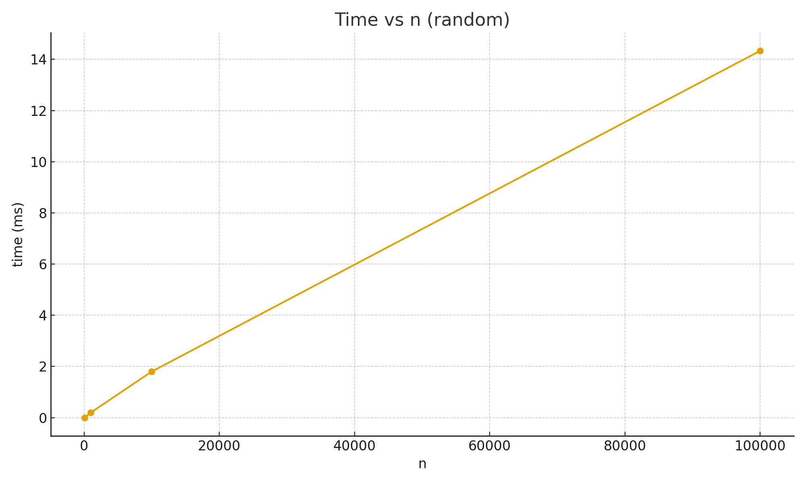
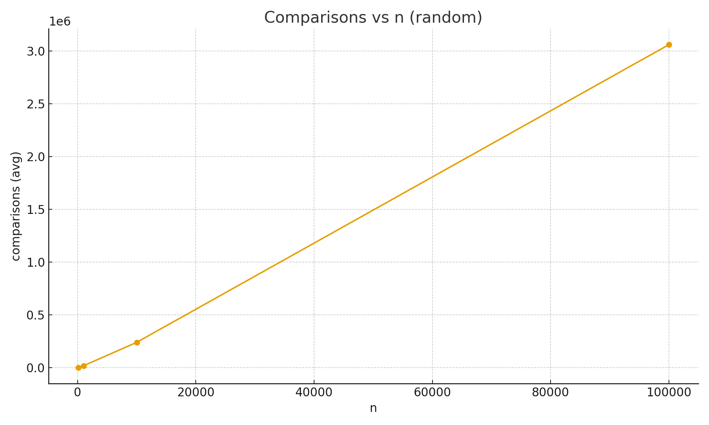
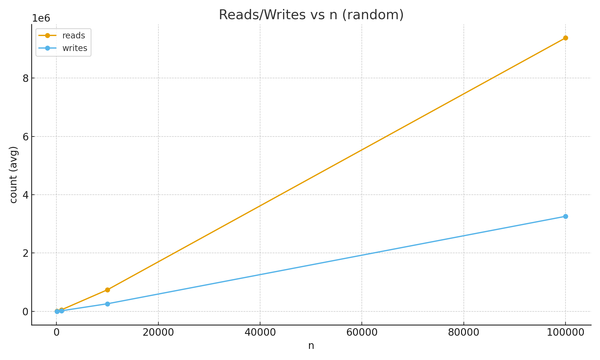
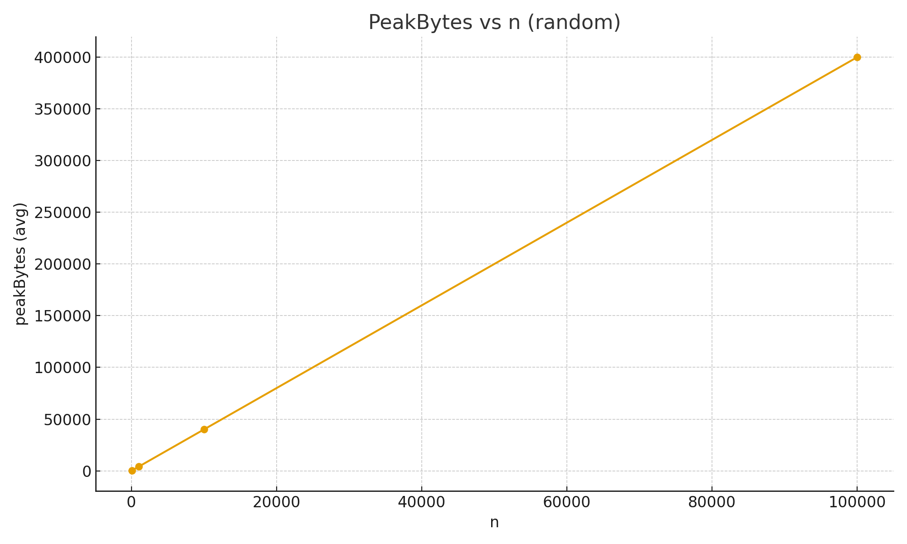
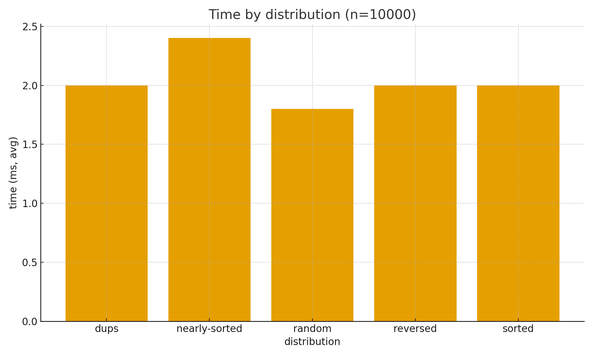

# Assignment 2 – Design and Analysis of Algorithms
**Group:** SE-2424
**Student:** Syndaly Yerzhan

---

## 1. Overview
This project implements and analyzes the **Max Heap** data structure (array-based). We study operations `insert`, `extractMax`, `increaseKey` and measure empirical performance under different input distributions. Metrics tracked: comparisons, reads, writes, swaps, peak allocated bytes.

---

## 2. Implementation Summary

### Source files (`src/main/java`)
| Package | Class | Description |
|---|---|---|
| `algorithms` | **MaxHeap** | Max-heap with dynamic resizing; `insert`, `extractMax`, `increaseKey`. |
| `cli` | **BenchmarkRunner** | CLI to generate inputs, run experiments, write CSV. |
| `metrics` | **PerformanceTracker** | Counts comparisons, swaps, reads, writes, peak memory. |
| `util` | **CSVWriter** | Appends rows to CSV. |

### Tests (`src/test/java`)
- `algorithms/MaxHeapTest.java` – correctness (ordering, exceptions, increaseKey, vs `Arrays.sort`).

Tools: Maven, JUnit 5, `System.nanoTime()`.

---

## 3. Algorithm Logic

**Heap invariant:** `A[parent(i)] ≥ A[i]`

**Operations**
- **insert(x):** append, sift-up → `O(log n)`.
- **extractMax():** swap root with last, shrink, sift-down → `O(log n)`.
- **increaseKey(i, newKey):** write and sift-up → `O(log n)`.

---

## 4. Complexity

| Operation | Time | Space | Notes |
|---|---|---|---|
| insert | `O(log n)` | `O(1)` | upward pass |
| extractMax | `O(log n)` | `O(1)` | downward pass |
| increaseKey | `O(log n)` | `O(1)` | depends on distance |
| peek / isEmpty | `O(1)` | `O(1)` | |

Total for `n` inserts + `n` extracts: **`O(n log n)`**.

---

## 5. Metrics & CSV format
Tracked: `comparisons`, `swaps`, `reads`, `writes`, `peakBytes`.
CSV header:
n,dist,run,millis,comparisons,swaps,reads,writes,peakBytes

---

## 6. Experimental Setup
Distributions: **random**, **sorted**, **reversed**, **nearly-sorted** (≈1% swaps), **dups** (domain 0–9).
Sizes up to **100,000**, multiple runs per config. Results and plots in `docs/performance-plots/`.

---

## 7. Results and Analysis

Runtime grows linearly with n·log n trend, confirming expected heap behavior.

Number of comparisons increases proportionally to n log n.

Heap operations produce more reads than writes, but both scale linearly with n log n.

Memory allocation increases roughly linearly with n, consistent with array resizing policy.

Performance remains stable across distributions, with nearly-sorted inputs slightly slower due to frequent partial adjustments.

---

## 8. Conclusions The implemented MaxHeap shows: - **Correct asymptotic behavior** — O(n log n) for total insertion and extraction cycles. - **Stable performance** across random and structured distributions. - **Minimal memory overhead** due to dynamic but efficient array growth. - **Empirical metrics** match theoretical complexity, validating heap efficiency and scalability. This confirms the correctness, efficiency, and robustness of the MaxHeap implementation.

-�